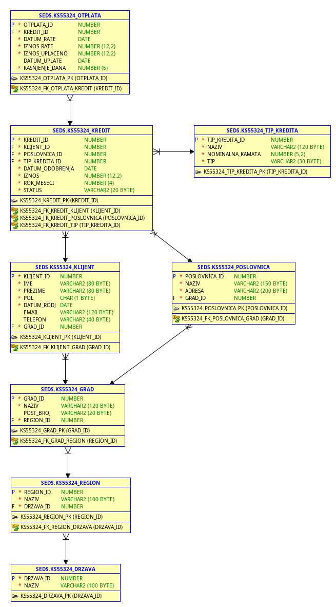

# Projektovanje i implementacija skladišta podataka za sistem naplate kredita

## Opis projekta

Ovaj projekat predstavlja implementaciju skladišta podataka (Data Warehouse) za analizu naplate kredita u bankarskom informacionom sistemu.

Cilj projekta bio je projektovanje i implementacija kompletnog analitičkog sistema koji omogućava efikasno skladištenje, obradu i analizu podataka prikupljenih iz operativnog (OLTP) sistema. Projekat obuhvata projektovanje baze podataka, implementaciju ETL procesa, razvoj Data Warehouse modela, analitičkih SQL upita i poslovnih izveštaja namenjenih podršci donošenju poslovnih odluka.

Projekat je realizovan u okviru predmeta **Softversko inženjerstvo za sisteme baza podataka** na Prirodno-matematičkom fakultetu Univerziteta u Novom Sadu.

---

# Korišćene tehnologije

- Oracle Database
- SQL
- PL/SQL
- Pentaho Data Integration (Spoon)
- Pentaho Report Designer
- Data Warehouse
- ETL (Extract, Transform, Load)
- OLTP / OLAP
- Star Schema
- Window Functions

---

# Funkcionalnosti

- Projektovanje OLTP baze podataka
- Projektovanje Data Warehouse modela
- Implementacija Star Schema modela
- Razvoj ETL procesa
- Punjenje dimenzionih tabela
- Punjenje fact tabele
- Implementacija analitičkih SQL upita
- Izrada poslovnih izveštaja
- Analiza naplate kredita po poslovnicama
- Analiza naplate kroz vreme
- Rangiranje poslovnica prema ukupnoj naplati
- Analiza kašnjenja u otplati kredita

---

# Arhitektura sistema

Proces implementacije projekta sastoji se od četiri osnovne faze:

1. Projektovanje OLTP baze podataka
2. Implementacija ETL procesa
3. Punjenje Data Warehouse baze podataka
4. Analitičko izveštavanje

---

# Model baze podataka

## OLTP model

Operativna baza podataka predstavlja izvor podataka za ETL proces.



---

## Data Warehouse model (Star Schema)

Dimenzioni model implementiran je korišćenjem Star Schema arhitekture radi efikasne analize velikih količina podataka.


---

# ETL proces

ETL proces implementiran je korišćenjem Pentaho Data Integration (Spoon) alata.

Proces obuhvata:

- ekstrakciju podataka iz OLTP baze,
- transformaciju podataka,
- generisanje surrogate ključeva,
- punjenje dimenzionih tabela,
- punjenje fact tabele.


---

# Poslovni izveštaji

U okviru projekta razvijeni su sledeći izveštaji:

- Mesečna naplata po poslovnici
- Mesečni rast naplate
- Rang poslovnica prema ukupnoj naplati
- Kumulativna naplata kroz vreme
- Top meseci po naplati
- Kašnjenje i broj uplata po poslovnici

### Mesečna naplata po poslovnici


### Rang poslovnica prema ukupnoj naplati


---

# Struktura projekta

```
bank-credit-data-warehouse
│
├── README.md
├── Seminarski.pdf
├── images/
├── sql/
├── etl/
├── reports/
└── dataset/
```

---

# Dokumentacija

Kompletna dokumentacija projekta dostupna je u fajlu:

## 📄 [Seminarski.pdf](Seminarski.pdf)

Dokumentacija sadrži:

- Motivaciju i ciljeve projekta
- Projektovanje OLTP baze podataka
- Logički model
- Relacioni model
- Data Warehouse model
- Star Schema dijagram
- ETL proces
- Implementaciju dimenzionih i fact tabela
- Analitičke SQL upite
- Poslovne izveštaje
- Analizu rezultata
- Zaključak

> **Napomena:** GitHub-ov ugrađeni pregled PDF dokumenata može nepravilno prikazati pojedine srpske karaktere (č, ć, š, ž, đ). Za ispravan prikaz preporučuje se preuzimanje dokumenta i otvaranje u PDF čitaču.
---

# Ključni koncepti

- Data Warehouse
- ETL
- OLTP
- OLAP
- Star Schema
- Oracle SQL
- PL/SQL
- Pentaho
- Window Functions
- Business Intelligence

---

# Autor

**Kristina Savković**
